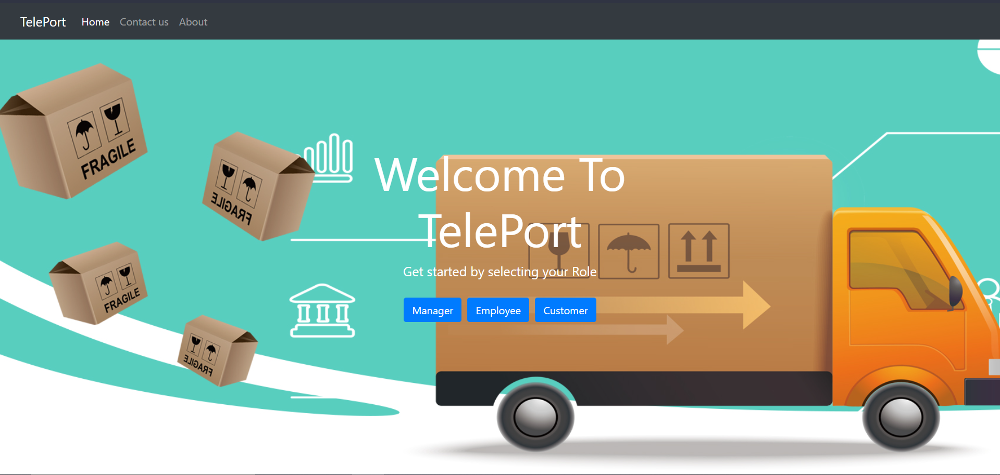
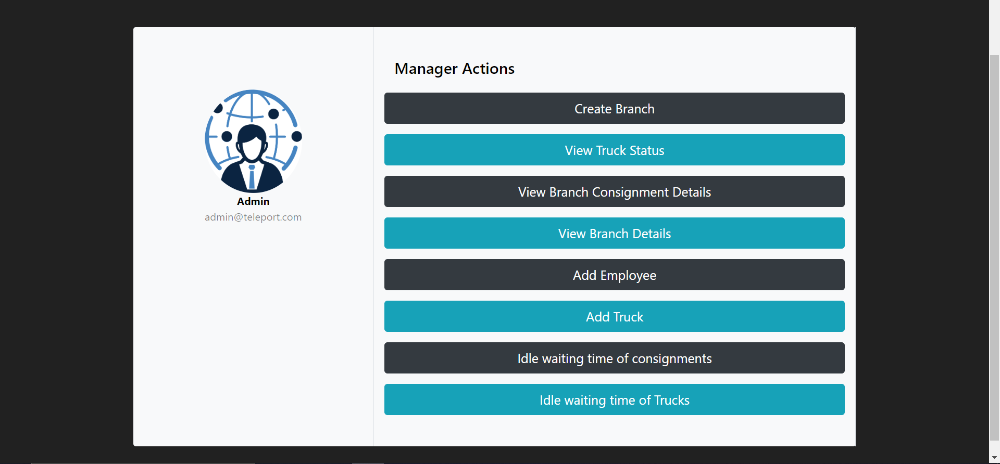
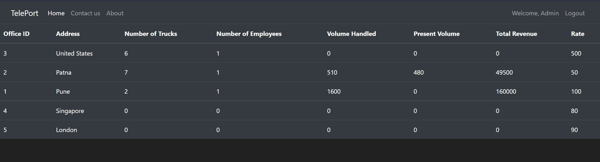
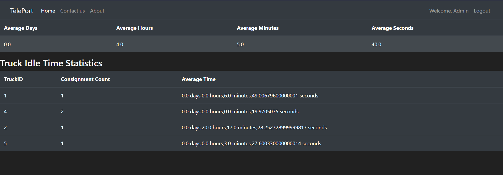
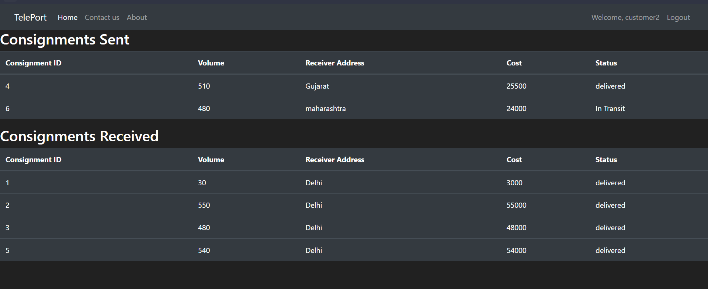

# TCCS - TelePort
TelePort is a Online Delivery Management Software where a customer can 
send,receive and track orders in a single place.
## Visit the Site
The Webiste is Hosted on Heroku, you can view the website by clicking [here](https://tccs-teleport.herokuapp.com/) 
## About the Website
The Software computerizes any delivery company’s book keeping activities associated with its 
operation with an efficient Truck Allotement and Dispatch Algorithm to ensure productivity.
resources available
## Remote Usage
To remotely use the codebase to host the website on your system, clone the repository on your system and do the Following Steps -

1.  Change The Database URI line inside the Teleport Package located in __init__.py

2.  Execute the Following line in the root folder to install all the requirements
```bash
pip install -r requirements.txt
```
3.  To Finally Run the Codebase, in the root directory, run the following command in the terminal
```python
python run.py
```

## Tech Stack Used
Frontend

    HTML
    CSS
    Bootstrap

Backend

    Flask
    SQLAlchemy 
    Heroku

## Development Team
1.  [Kushaz Sehgal](https://github.com/kushazsehgal)

2.  [Shivam Raj](https://github.com/Shivam751)

3.  [Hardik Soni](https://github.com/iamhardikat11)


## Screenshots
1.  

2.  

3.  

4.  

5.  

6.  
